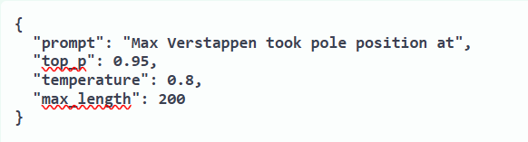
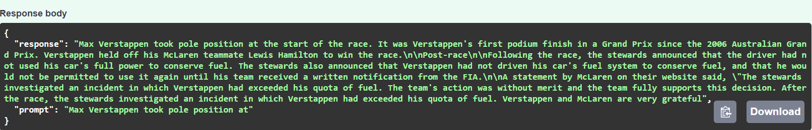
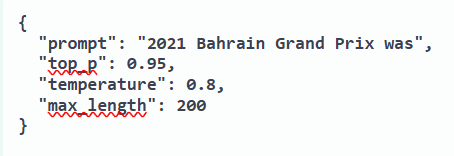
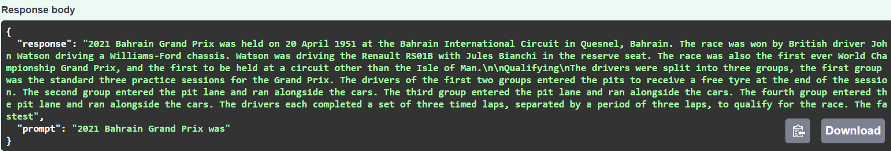

# Formula-1---GPT-2-Model---MLOps-


A production-ready MLOps pipeline for a GPT-2 language model fine-tuned on Formula 1 Wikipedia data.

---

## Overview

This project explores the full MLOps lifecycle by fine-tuning a GPT-2 language model on Formula 1 data extracted from Wikipedia. A user sends a text prompt to a REST API and the model returns a generated F1-style continuation. Built to learn end-to-end MLOps — from data collection and model training to serving, containerization, and CI.

## Tech Stack

| Category | Technology |
|----------|------------|
| Language | Python 3.11|
|   Model  | GPT-2(124 M Parameters) |
|Training  |PyTorch, HuggingFace, Transformers |
| Experiment Tracking | Weights & Biases (W&B) |
| API Framework | FastAPI + Uvicorn |
|Containerization|Docker|
|CI/CD|Github Actions|
|Data Source|Wikipedia via HuggingFace Datasets|

## Project Structure

```
Formula-1---GPT-2-Model---MLOps-/
├── notebooks/
│   ├── Phase_1_Data.ipynb       # Data collection and preprocessing
│   └── Phase_2_Model.ipynb      # GPT-2 fine-tuning and evaluation
├── src/
│   ├── api/
│   │   ├── main.py              # FastAPI app and endpoints
│   │   ├── model.py             # Model loading and text generation
│   │   ├── schemas.py           # Request and response schemas
│   │   └── requirements.txt     # API dependencies
│   └── tests/
│       ├── __init__.py
│       └── test_api.py          # Automated API tests
├── docker/
│   └── Dockerfile               # Container build instructions
├── .github/
│   └── workflows/
│       └── ci.yml               # GitHub Actions CI pipeline
├── docker-compose.yml           # Container orchestration
├── .gitignore
└── README.md
```

## MLOps Pipeline

### Phase 1 - Data Collection & Pre Processing
Data was extracted from the 2023 Wikipedia dump using HuggingFace Datasets in streaming mode. A curated F1 keyword list filtered 6.4 million articles down to 1,278 F1-relevant articles covering races, drivers, teams, and circuits. Each article was cleaned using regex to remove citations and reference sections. All articles were concatenated into one corpus separated by GPT-2's `<|endoftext|>` token — signaling document boundaries so the model doesn't learn relationships across unrelated articles. Final corpus: 2.1 million tokens saved to Google Drive.

### Phase 2 - Model Building
The cleaned corpus was loaded from Google Drive and tokenized using GPT-2's pretrained tokenizer. The tokenized corpus was chunked into 1024-token sequences — GPT-2's maximum context window — and split 90/10 into training and validation sets, giving 464 training batches and 52 validation batches. W&B experiment tracking was initialized to log loss, perplexity, and hyperparameters across all runs. GPT-2 small (124M parameters) was fine-tuned for 3 epochs using AdamW optimizer with a linear warmup scheduler and learning rate of 5e-5. Model checkpoints were saved to Google Drive after each epoch. Final validation loss: 2.71, perplexity: ~15.

### Phase 3 — Model Serving
Three files were created to serve the model as a REST API. `schemas.py` defines the request and response structure using Pydantic — what the client sends and what the server returns. `model.py` handles model loading and text generation — the model loads once on startup via an environment variable `MODEL_PATH` which points to either a local checkpoint or HuggingFace Hub. `main.py` creates the FastAPI application with two endpoints: `GET /` for health checks and `POST /generate` which accepts a prompt and returns generated F1 text.

### Phase 4 - Containerization
Docker was used to containerize the FastAPI app. The `Dockerfile` packages the app with Python 3.11 and all required dependencies using `python:3.11-slim` as the base image for smaller size. Dependencies are copied and installed before the app code — leveraging Docker's layer caching so rebuilds don't reinstall packages unless `requirements.txt` changes. `docker-compose.yml` defines port mapping and the `MODEL_PATH` environment variable so the container loads the model from HuggingFace Hub on startup. Tested locally — container successfully served requests at `http://localhost:8000`.

### Phase 5 - CI with GitHub Actions 
A CI pipeline was set up using GitHub Actions to automatically run checks on every push to the `main` branch. The workflow runs on GitHub's Ubuntu servers and consists of five steps: checkout code, set up Python 3.11, install dependencies, lint with flake8 for PEP 8 compliance, and run pytest. Two automated tests verify the API — `test_health_check` confirms the health endpoint returns 200, and `test_generate_endpoint_exists` confirms the generate endpoint responds correctly without loading the full model.

## Model
- Base model: GPT-2 small (124M parameters), fine-tuned on F1 Wikipedia data
- Training: 3 epochs, learning rate 5e-5, AdamW optimizer with 0.01 weight decay
- Training loss: 3.16 → 2.52 | Validation loss: 2.81 → 2.71
- Perplexity: 16.67 → 15.09
- Fine-tuned model available on HuggingFace Hub: [neil-gosalia/f1-gpt2](https://huggingface.co/neil-gosalia/f1-gpt2)

## Demo

**Prompt 1: "Max Verstappen took pole position at"**



**Prompt 2: "2021 Bahrain Grand Prix was"**



## Local Setup

### Prerequisites
- Python 3.11
- Docker Desktop
- Git

### Steps

**1. Clone the repository**
```bash
git clone https://github.com/neil-gosalia/Formula-1---GPT-2-Model---MLOps-.git
cd Formula-1---GPT-2-Model---MLOps-
```

**2. Create and activate virtual environment**
```bash
python -m venv venv
.\venv\Scripts\Activate.ps1  # Windows
source venv/bin/activate      # Mac/Linux
```

**3. Install dependencies**
```bash
pip install -r src/api/requirements.txt
```

**4. Set up environment file**
Create `src/api/.env`:
MODEL_PATH=path/to/local/checkpoint
Or leave unset to load `neil-gosalia/f1-gpt2` from HuggingFace Hub automatically.


**5. Run the server**
```bash
cd src/api
uvicorn main:app --reload
```

**6. Test the API**
Go to `http://127.0.0.1:8000/docs`


## API Usage

### Health Check
```bash
curl http://127.0.0.1:8000/
```

**Response:**
```json
{
  "status": "ok",
  "model": "f1 text generation"
}
```

### Generate Text
```bash
curl -X POST http://127.0.0.1:8000/generate \
  -H "Content-Type: application/json" \
  -d '{
    "prompt": "Max Verstappen took pole position at",
    "max_length": 200,
    "temperature": 0.8,
    "top_p": 0.95
  }'
```

**Response:**
```json
{
  "response": "Max Verstappen took pole position at the start of the race. It was Verstappen's first podium finish in a Grand Prix since the 2006 Australian Grand Prix. Verstappen held off his McLaren teammate Lewis Hamilton to win the race.\n\nPost-race\nFollowing the race, the stewards announced that the driver had not used his car's full power to conserve fuel. The stewards also announced that Verstappen had not driven his car's fuel system to conserve fuel, and that he would not be permitted to use it again until his team received a written notification from the FIA.\n\nA statement by McLaren on their website said, \"The stewards investigated an incident in which Verstappen had exceeded his quota of fuel. The team's action was without merit and the team fully supports this decision. After the race, the stewards investigated an incident in which Verstappen had exceeded his quota of fuel. Verstappen and McLaren are very grateful",
  "prompt": "Max Verstappen took pole position at"
}
```

## Deployment Note
This project cannot be deployed on Render's free tier due to its 512MB memory limit. The fine-tuned GPT-2 model (500MB) combined with PyTorch overhead exceeds this limit. Production deployment would require a minimum 2GB RAM instance. The full pipeline is demonstrated locally via Docker. The fine-tuned model is available on HuggingFace Hub at [neil-gosalia/f1-gpt2](https://huggingface.co/neil-gosalia/f1-gpt2).